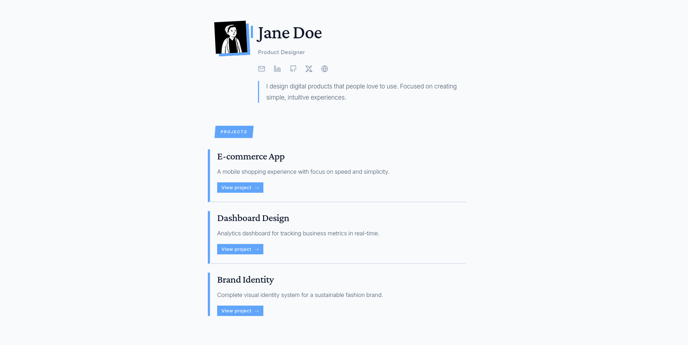
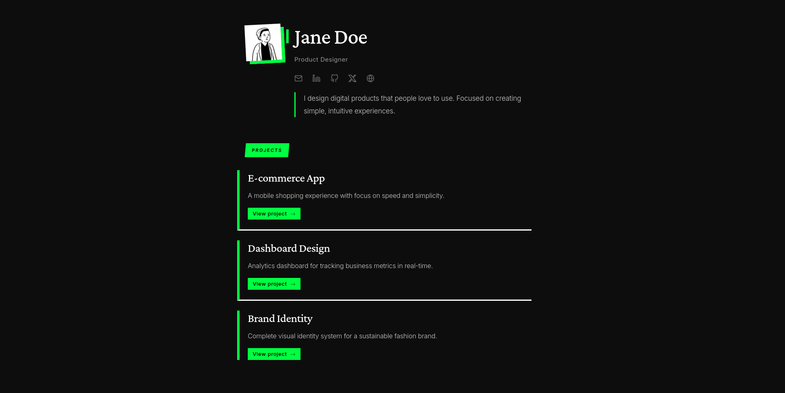
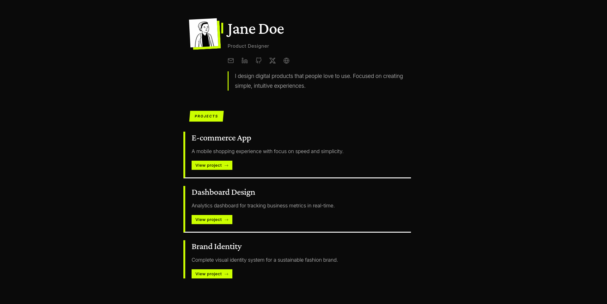
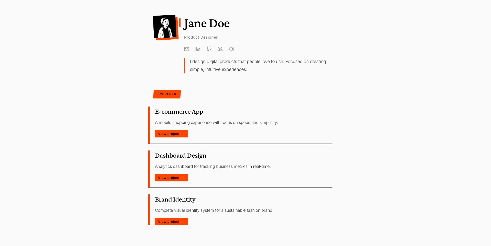
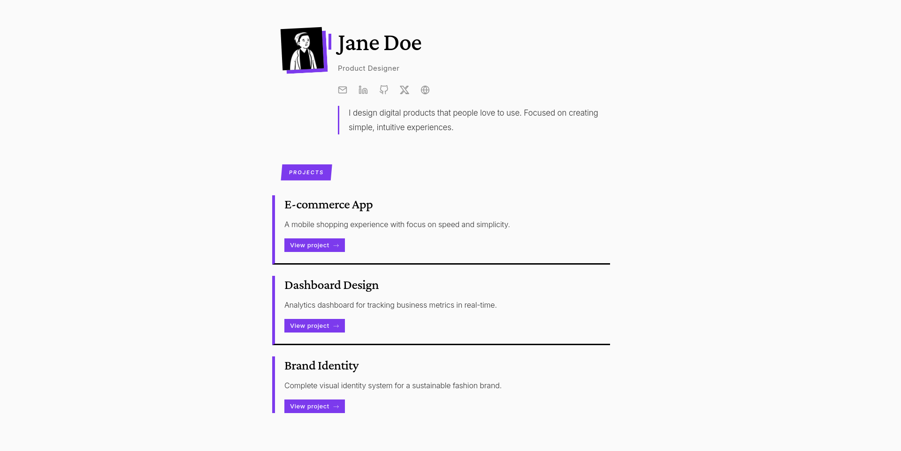

# Available Themes

Choose your theme by editing the `theme` field in `config.js`:

```javascript
theme: "light",  // Change this to any theme name below
```

**💡 Pro Tip:** Theme names are flexible! You can write them as:
- `"monolith-dark"` or `"monolith dark"` or `"Monolith Dark"`
- `"eclipse-warm"` or `"eclipse warm"` or `"Eclipse Warm"`
- The template automatically handles spaces, dashes, and capitalization!

---

## Classic Themes

### Light


```javascript
theme: "light"
```
The default clean black text on white background - timeless and professional.

### Dark

```javascript
theme: "dark"
```
White text on deep black background - modern and elegant.

---

## Standard Color Themes

### Ivory


```javascript
theme: "ivory"
```
Soft cream background with warm dark text.

### Charcoal


```javascript
theme: "charcoal"
```
Dark gray background with light text.

### Espresso


```javascript
theme: "espresso"
```
Rich coffee brown tones.

### Mint


```javascript
theme: "mint"
```
Fresh mint green background.

### Lavender


```javascript
theme: "lavender"
```
Soft purple tones for a creative touch.

### Burgundy


```javascript
theme: "burgundy"
```
Deep red wine color palette.

### Terracota


```javascript
theme: "terracota"
```
Warm earthy orange-red tones.

### Deep Forest


```javascript
theme: "deep-forest"
```
Rich forest green background.

### Deep Ocean


```javascript
theme: "deep-ocean"
```
Deep blue ocean-inspired palette.

### Metallic Gold


```javascript
theme: "metallic-gold"
```
Luxurious gold and black combination.

### Slate Gray


```javascript
theme: "slate-gray"
```
Cool gray with balanced contrast.

### Slate Purple


```javascript
theme: "slate-purple"
```
Purple-tinted gray background.

### Concrete Lime


```javascript
theme: "concrete-lime"
```
Industrial gray with lime green accents.

### Brutal Lime

```javascript
theme: "brutal-lime"
```
Bold lime green and black contrast.

---

## Brutalist Themes

Brutalist themes feature bold, raw aesthetics with strong geometric elements and unconventional layouts.

### Brutalist Artic


```javascript
theme: "brutalist-artic"
```
Icy blue brutalist design with sharp angles.

### Brutalist Green


```javascript
theme: "brutalist-green"
```
Bold green with brutalist structure.

### Brutalist Lime


```javascript
theme: "brutalist-lime"
```
Electric lime green brutalist layout.

### Brutalist Orange


```javascript
theme: "brutalist-orange"
```
Vibrant orange brutalist aesthetic.

### Brutalist Purple

```javascript
theme: "brutalist-purple"
```
Purple tones with raw brutalist elements.

---

## Eclipse Themes

Eclipse themes offer sophisticated dark backgrounds with contrasting light text and elegant accents.

### Eclipse Dark


```javascript
theme: "eclipse-dark"
```
Pure eclipse aesthetic with deep shadows.

### Eclipse Light


```javascript
theme: "eclipse-light"
```
Inverted eclipse with light background.

### Eclipse Warm

    
```javascript
theme: "eclipse-warm"
```
Eclipse theme with warm amber tones.

---

## Monolith Themes

Monolith themes embrace minimalism with strong monochromatic palettes and bold typography.

### Monolith Dark


```javascript
theme: "monolith-dark"
```
Pure black monolithic design.

### Monolith Light

```javascript
theme: "monolith-light"
```
Pure white monolithic aesthetic.

---

## Paco Themes

Paco themes feature unique color combinations with balanced contrast and modern styling.

### Paco Dark


```javascript
theme: "paco-dark"
```
Dark Paco theme with signature styling.

### Paco Light

```javascript
theme: "paco-light"
```
Light Paco theme with clean aesthetics.

---

## Ultra Themes

Ultra themes push boundaries with maximum contrast and dramatic visual impact.

### Ultra Dark


```javascript
theme: "ultra-dark"
```
Maximum darkness with high contrast.

### Ultra Light

```javascript
theme: "ultra-light"
```
Maximum brightness with bold elements.

---

## Quick Reference

```javascript
// Classic
"light", "dark"

// Standard Colors
"ivory", "charcoal", "espresso", "mint", "lavender", 
"burgundy", "terracota", "deep-forest", "deep-ocean", 
"metallic-gold", "slate-gray", "slate-purple", 
"concrete-lime", "brutal-lime"

// Brutalist
"brutalist-artic", "brutalist-green", "brutalist-lime", 
"brutalist-orange", "brutalist-purple"

// Eclipse
"eclipse-dark", "eclipse-light", "eclipse-warm"

// Monolith
"monolith-dark", "monolith-light"

// Paco
"paco-dark", "paco-light"

// Ultra
"ultra-dark", "ultra-light"
```

---

## Tips

- **Flexible naming:** Write themes however you like - `"brutalist-lime"`, `"brutalist lime"`, or `"Brutalist Lime"` all work!
- **Case doesn't matter:** `"Light"`, `"light"`, or `"LIGHT"` - use whatever feels natural
- **Spaces or dashes:** Both `"eclipse-warm"` and `"eclipse warm"` work perfectly
- If a theme isn't found, it defaults to the Light theme
- Preview all themes by changing the value in `config.js` and refreshing your browser
- Mix and match - try different themes until you find your perfect match!
